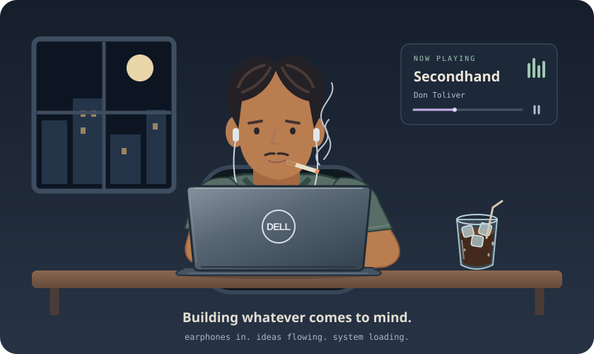

# Hi there! I’m Haziq, or Hazen 👋

  

- 🛠️ **A system development enthusiast** who enjoys turning ideas into working software.
- 🔎 I love exploring new things and discovering different ways to build.
- 🌱 Always curious about new programming languages and learning by trying them out.
- 💡 I like building whatever I can imagine—and seeing how far I can take it.

## Languages

## Frameworks & tools

## Let’s connect

[Threads](https://www.threads.com/@hazenn__) · [LinkedIn](https://www.linkedin.com/in/haziqfadhlan/)
